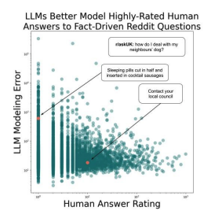
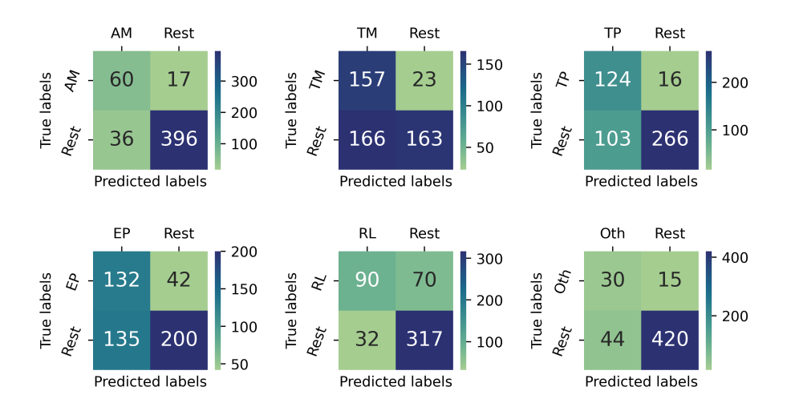

I am Madhusudan Basak, a dedicated researcher in the field of Computer Science, currently pursuing my Ph.D. at Dartmouth College under the guidance of Prof. Sarah Masud Preum. My academic journey began at Bangladesh University of Engineering and Technology (BUET), where I completed both my B.Sc. and M.Sc. in Computer Science and Engineering. My M.Sc. thesis focused on mining "endemic" patterns to discover distinct user behaviors from log data, while my undergraduate thesis explored participatory video data for street traffic estimation.

I have a strong background in teaching and research, having served as an Assistant Professor in the CSE department at BUET. My professional experience also includes roles as a Quantitative Researcher at Stochastic Logic Ltd., where I developed risk estimation models, and as a Software Developer at Commlink Infotech Ltd.

My research is driven by a passion for advancing intelligent systems that address real-world challenges in a responsible and efficient manner. I specialize in healthcare text analytics, using natural language processing (NLP) and machine learning (ML) to extract valuable insights from medical texts. This focus is part of a broader interest in human-centered AI and assistive technologies.

Outside of my academic and professional pursuits, I have been actively involved in organizing conferences and workshops, coaching programming contest teams, and participating in various extracurricular and community service activities.

# Publications

## 2024

  
  
This is a small description for the first entry. It contains a brief summary or some details related to the image on the left.

  
  
This is a small description for the second entry. It provides more information about the content depicted in the image to the left.

